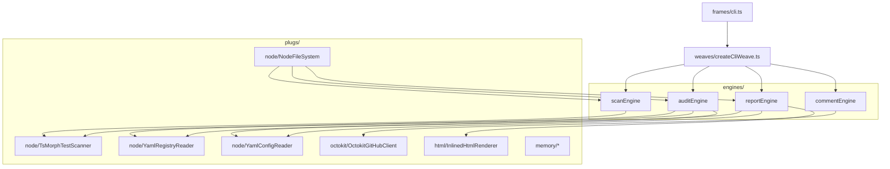
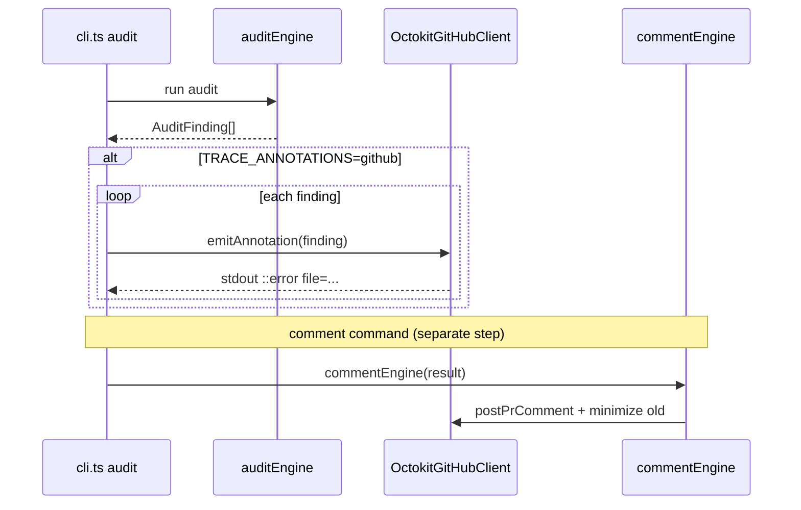

# Traceability framework — internal architecture

> How `tools/requirements-tracer/` is structured: typed modules, explicit interfaces, and swappable I/O implementations.

Audience: contributors and fork maintainers. Adopters should start with [onboarding.md](onboarding.md).

---

## TL;DR

- Package path: `tools/requirements-tracer/`
- **`motes/`** — shared types, constants, registry loading
- **`sparks/`** — pure helpers (parse trace IDs, JSDoc, HTML escape)
- **`engines/`** — scan, audit, report, comment use-cases
- **`sockets/`** — interfaces (FileSystem, GitHubClient, …)
- **`plugs/`** — Node, Octokit, HTML, and in-memory implementations
- **`weaves/`** — composition root (`createCliWeave.ts`)
- **`frames/`** — CLI entry (`cli.ts`, Commander)
- Tests live in `test/` beside the layer they exercise; Vitest + in-memory plugs, no mock library

---

## Command pipeline



| Command | Engine | Primary outputs |
|---------|--------|-----------------|
| `scan` | `scanEngine` | JSON list of `TestCase` |
| `audit` | `auditEngine` | `AuditResult`, stdout findings, optional GitHub annotations |
| `report` | `reportEngine` | `index.html`, `summary.json`, optional `scan.json` / `audit.json` |
| `comment` | `commentEngine` | PR comment via Octokit |

---

## Folder layout (actual)

```
tools/requirements-tracer/
├── package.json
├── tsconfig.json
├── src/
│   ├── motes/                         ← types, defaults, registry merge
│   │   ├── types.ts                   ← TestCase, AuditFinding, AuditResult, …
│   │   ├── traceIdPattern.ts
│   │   ├── defaultGlobs.ts
│   │   ├── exitCodes.ts
│   │   ├── loadRegistry.ts
│   │   ├── mergeRegistryShards.ts
│   │   └── parseRegistryDocument.ts
│   │
│   ├── sparks/                        ← pure functions
│   │   ├── parseTraceIds.ts
│   │   ├── parseJsdocTags.ts
│   │   ├── classifyTestFile.ts
│   │   ├── htmlEscape.ts
│   │   └── resolveLinkedToken.ts
│   │
│   ├── engines/                       ← one per CLI command
│   │   ├── scanEngine.ts
│   │   ├── auditEngine.ts
│   │   ├── reportEngine.ts
│   │   └── commentEngine.ts
│   │
│   ├── sockets/                       ← interfaces
│   │   ├── FileSystem.ts
│   │   ├── RegistryReader.ts
│   │   ├── ConfigReader.ts
│   │   ├── TestScanner.ts
│   │   ├── GitHubClient.ts
│   │   └── HtmlRenderer.ts
│   │
│   ├── plugs/                         ← implementations
│   │   ├── node/
│   │   │   ├── NodeFileSystem.ts
│   │   │   ├── YamlRegistryReader.ts
│   │   │   ├── YamlConfigReader.ts
│   │   │   └── TsMorphTestScanner.ts    ← ts-morph AST walk for test()
│   │   ├── octokit/
│   │   │   └── OctokitGitHubClient.ts   ← annotations + PR comments
│   │   ├── html/
│   │   │   ├── InlinedHtmlRenderer.ts
│   │   │   ├── renderMappyTraceReport.ts
│   │   │   ├── buildMappyReportData.ts
│   │   │   ├── mappyReportStyles.ts
│   │   │   └── mappyReportClient.template.js
│   │   └── memory/                      ← test doubles
│   │       ├── InMemoryFileSystem.ts
│   │       ├── InMemoryGitHubClient.ts
│   │       └── StubTestScanner.ts
│   │
│   ├── weaves/
│   │   └── createCliWeave.ts            ← wires production plugs
│   │
│   └── frames/
│       └── cli.ts                       ← Commander: scan | audit | report | comment
│
└── test/
    ├── engines/
    │   ├── auditEngine.test.ts
    │   ├── reportEngine.test.ts
    │   └── commentEngine.test.ts
    ├── sparks/
    │   ├── parseTraceIds.test.ts
    │   ├── parseJsdocTags.test.ts
    │   ├── classifyTestFile.test.ts
    │   ├── htmlEscape.test.ts
    │   └── resolveLinkedToken.test.ts
    └── motes/
        └── mergeRegistryShards.test.ts
```

---

## GitHub integration (annotations + comments)



- **Annotations** — no GitHub API call; stdout commands parsed by Actions ([ci-integration.md](ci-integration.md)).
- **Comments** — REST `issues.createComment`; optional GraphQL minimize for prior traceability comments.

---

## Key data shapes

Defined in `src/motes/types.ts`:

```typescript
export interface TestCase {
  readonly filePath: string;
  readonly line: number;
  readonly framework: 'jest' | 'vitest' | 'cypress' | 'playwright' | 'unknown';
  readonly description: string;
  readonly traceIds: readonly string[];
  readonly tags: {
    readonly description?: string;
    readonly owner?: string;
    readonly kind?: string;
    readonly priority?: 'low' | 'medium' | 'high' | 'critical';
    readonly linked?: readonly string[];
    readonly coverage?: string;
    readonly external?: readonly string[];
  };
}

export interface AuditFinding {
  readonly severity: 'error' | 'warning';
  readonly rule:
    | 'missing-trace-id'
    | 'unknown-trace-id'
    | 'orphan-requirement'
    | 'unknown-jsdoc-tag'
    | 'duplicate-jsdoc-tag'
    | 'deprecated-requirement-referenced'
    | 'kind-mismatch';
  readonly message: string;
  readonly filePath?: string;
  readonly line?: number;
  readonly requirementId?: string;
  readonly suggestion: string;
}

export interface AuditResult {
  readonly testsScanned: number;
  readonly requirementsKnown: number;
  readonly requirementsCovered: number;
  readonly findings: readonly AuditFinding[];
  readonly ok: boolean;
  readonly testCases: readonly TestCase[];
  readonly registry: Registry;
  readonly config: TraceabilityConfig;
  readonly coverage: Readonly<Record<string, readonly TestCase[]>>;
}
```

---

## CLI exit codes

| Command | Exit `0` | Exit non-zero |
|---------|----------|---------------|
| `scan` | Always (unless I/O error) | I/O failure |
| `audit` | No error-severity findings | One or more errors |
| `report` | HTML written | I/O or render failure |
| `comment` | Comment posted | Missing GitHub context or API error |

Warnings alone do not fail `audit` unless `--strict` promotes them.

---

## Test discipline

- Unit tests target `sparks/` and `motes/` with plain inputs/outputs.
- Engine tests use `plugs/memory/` — real in-process code, not a mocking framework.
- Tracer tests **dogfood** trace IDs in their own `test('[META-…] …')` descriptions.

Example:

```typescript
// test/engines/auditEngine.test.ts (abbreviated)
test('[META-001] flags a test that lacks a trace ID', async () => {
  const scanner = new StubTestScanner([{
    filePath: 'src/foo.test.ts',
    line: 3,
    framework: 'vitest',
    description: 'returns a value',
    traceIds: [],
    tags: {},
  }]);
  // …
  expect(result.findings).toContainEqual(
    expect.objectContaining({ rule: 'missing-trace-id', line: 3 }),
  );
});
```

---

## Why interface-first?

The tracer touches the file system, GitHub, and HTML generation — three surfaces that are painful to test when logic and I/O are tangled.

| Benefit | How |
|---------|-----|
| Pure audit core | `auditEngine` is a function of `TestCase[]` + registry + config |
| Swappable GitHub | `OctokitGitHubClient` is one `GitHubClient` plug |
| Replaceable HTML | `InlinedHtmlRenderer` implements `HtmlRenderer` without touching audit |
| Fast tests | `StubTestScanner` + `InMemoryFileSystem` avoid disk and network |

---

## Related pages

- [ci-integration.md](ci-integration.md) — how `cli.ts` sets `TRACE_ANNOTATIONS` and `TRACE_ARTIFACT_URL`
- [configuration.md](configuration.md) — what `YamlConfigReader` validates
- [index.md](index.md) — user-facing overview
