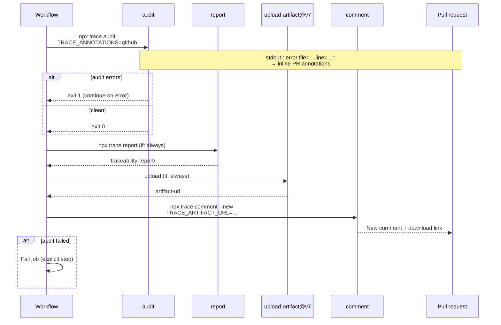
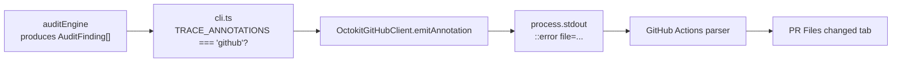

# Traceability framework — CI integration

> How audit, report, artifact upload, PR comments, and **GitHub line annotations** hook into GitHub Actions — and how to mirror the same checks locally.

---

## TL;DR

- **Fastest path:** `Underwood-Inc/requirements-tracer-action@v0.1.2` with `tracer-package: '@underwoodinc/requirements-tracer@0.1.2'`.
- **Pipeline:** `audit` → `report` → `upload-artifact` → `comment` → fail job if audit had errors.
- **`TRACE_ANNOTATIONS=github`** during `audit` emits `::error` / `::warning` lines so failures appear **on the PR diff**.
- **`TRACE_ARTIFACT_URL`** (from `upload-artifact@v7` `artifact-url` output) gives the PR comment a **direct download link**.
- PR comments are **new each run**; previous traceability comments are **minimized** (collapsed) so the latest summary stays visible.
- **`--strict`** promotes orphan, deprecated, and unknown-JSDoc warnings to errors.

Full adoption guide: [onboarding.md](onboarding.md). Configuration reference: [configuration.md](configuration.md).

---

## CI pipeline (sequence)



---

## Published GitHub Action (recommended)

For repos that do **not** vendor the tracer source, use the composite Action and npm package:

```yaml
name: Traceability

on:
  pull_request:
    branches: [main]
  push:
    branches: [main]

permissions:
  contents: read
  pull-requests: write   # PR comments
  checks: write          # line annotations from ::error / ::warning

concurrency:
  group: traceability-${{ github.ref }}
  cancel-in-progress: true

jobs:
  traceability:
    runs-on: ubuntu-latest
    steps:
      - uses: actions/checkout@v4

      - uses: Underwood-Inc/requirements-tracer-action@v0.1.2
        with:
          tracer-package: '@underwoodinc/requirements-tracer@0.1.2'
          token: ${{ secrets.GITHUB_TOKEN }}
          strict: 'false'          # set 'true' on release branches
          post-comment: 'true'
```

The Action runs, in order: **Setup Node** → **audit** (`continue-on-error: true`) → **report** (`if: always`) → **upload-artifact@v7** (`if: always`) → **comment** (`if: always` on PRs) → **fail** if audit step failed.

### Action inputs

| Input | Default | Purpose |
|-------|---------|---------|
| `working-directory` | `.` | Root passed to `--root` (contains `.traceability.yaml`) |
| `config-path` | `.traceability.yaml` | Relative to working-directory |
| `registry-path` | `requirements-registry.yaml` | Relative to working-directory |
| `tracer-package` | *(empty)* | When set, `npx --yes` runs this package instead of local `tracer-path` |
| `tracer-path` | `tools/requirements-tracer/dist/frames/cli.js` | Monorepo / vendored CLI |
| `build-tracer` | `false` | Run `pnpm build:tracer` before audit (monorepo adopters) |
| `strict` | `false` | Pass `--strict` to audit, report, and comment |
| `post-comment` | `true` | Skip PR comment when `false` |
| `artifact-name` | `traceability-report` | Uploaded artifact name |
| `report-dir` | `traceability-report` | Must match `output.reportDir` in config |
| `token` | `${{ github.token }}` | Needs `pull-requests: write` for comments |
| `node-version` | `22` | Node for npx / local CLI |

### Action outputs

| Output | Value |
|--------|-------|
| `audit-outcome` | `success` or `failure` from the audit step |

---

## Monorepo workflow (vendored tracer)

This repository builds the tracer from source and runs pnpm scripts. Same behaviour as the Action, but you own each step:

```yaml
# .github/workflows/traceability.yml (representative)
name: Traceability Audit

on:
  pull_request:
    branches: [main]
  push:
    branches: [main]

permissions:
  contents: read
  pull-requests: write
  checks: write

jobs:
  audit:
    runs-on: ubuntu-latest
    steps:
      - uses: actions/checkout@v4
        with:
          fetch-depth: 0

      - uses: pnpm/action-setup@v4
        with:
          version: 10
          run_install: false

      - uses: actions/setup-node@v4
        with:
          node-version: 22
          cache: pnpm

      - run: pnpm install --frozen-lockfile
      - run: pnpm build:tracer

      - name: Run audit
        id: audit
        continue-on-error: true
        run: pnpm trace:audit
        env:
          GITHUB_TOKEN: ${{ secrets.GITHUB_TOKEN }}
          TRACE_ANNOTATIONS: github

      - name: Generate report
        if: always()
        run: pnpm trace:report

      - name: Upload report artifact
        id: upload-report
        if: always()
        uses: actions/upload-artifact@v7
        with:
          name: traceability-report
          path: traceability-report
          retention-days: 30

      - name: Post PR comment
        if: always() && github.event_name == 'pull_request'
        env:
          GITHUB_TOKEN: ${{ secrets.GITHUB_TOKEN }}
          TRACE_ARTIFACT_URL: ${{ steps.upload-report.outputs.artifact-url }}
        run: pnpm trace:comment -- --new

      - name: Fail on audit errors
        if: steps.audit.outcome == 'failure'
        run: |
          echo "::error::Traceability audit found errors. See PR comment and artifact."
          exit 1
```

### Why each step is shaped this way

| Choice | Reason |
|--------|--------|
| `fetch-depth: 0` | Full history helps line mapping on complex merges |
| `continue-on-error` on audit | Report + artifact + comment still run when audit fails |
| `if: always()` on report / upload / comment | Reviewers need the HTML artifact to understand failures |
| `TRACE_ANNOTATIONS=github` on audit only | Annotations are stdout side-effects of `audit`, not `comment` |
| `TRACE_ARTIFACT_URL` | v0.1.2+ uses `upload-artifact@v7` direct download URL in the PR comment |
| Separate fail step | Job fails after artifacts and comment are published |
| `--new` on comment | Posts a fresh comment; older ones minimized via GraphQL |

---

## GitHub Actions annotations

GitHub Actions reads special commands written to **stdout** during a step. When `TRACE_ANNOTATIONS=github` is set, the tracer emits one line per finding:

```
::error file=path,line=N,title=Title::Message | Suggestion
::warning file=path,line=N,title=Title::Message | Suggestion
```

### Annotation flow



### Which findings become annotations?

| Rule | Annotation level | `file` + `line` | Example title |
|------|------------------|-----------------|---------------|
| `missing-trace-id` | `error` | Yes | Missing trace ID |
| `unknown-trace-id` | `error` | Yes | Unknown trace ID FR-999 |
| `kind-mismatch` | `error` | Yes | kind-mismatch |
| `deprecated-requirement-referenced` | `warning` | Yes | Deprecated requirement FR-001 referenced |
| `unknown-jsdoc-tag` | `warning` | Yes | Unknown JSDoc tag |
| `duplicate-jsdoc-tag` | `warning` | Yes | Duplicate JSDoc tag |
| `orphan-requirement` | `warning` | **No** | Requirement FR-007 has no tests |

Orphan requirements have no test file to point at — they appear in the **PR comment** and HTML report only.

### Body format and escaping

The implementation (`OctokitGitHubClient.emitAnnotation`) builds:

1. **Command:** `error` or `warning` from finding severity.
2. **Properties:** `file=…`, `line=…`, `title=…` (title derived from rule + requirement ID).
3. **Body:** `{message} | {suggestion}` with `\r`, `\n`, `]`, and `;` percent-encoded for GitHub's parser.

Example (as seen in workflow logs):

```
::error file=src/auth/session.test.ts,line=7,title=Unknown trace ID SEC-099::Test references [SEC-099] which is not in the registry. | Add SEC-099 to requirements-registry.yaml or update the test.
::warning file=src/checkout/refund.test.ts,line=22,title=Unknown JSDoc tag::Tag @reviewer is not in jsdocTags.optional. | Add it to .traceability.yaml or remove the tag.
```

### Enabling annotations

| Context | How |
|---------|-----|
| Published Action | Set automatically (`TRACE_ANNOTATIONS: github` in audit step) |
| Custom workflow | `env: TRACE_ANNOTATIONS: github` on the audit step |
| Local debugging | `TRACE_ANNOTATIONS=github npx trace audit --root .` (prints to terminal; GitHub only interprets them in Actions) |

**Permissions:** `checks: write` on the workflow job (included in the examples above).

### Where annotations appear in the UI

1. **Checks** tab — step summary lists annotation counts.
2. **Files changed** — inline markers on the affected line when the file is part of the PR diff.
3. **Workflow log** — raw `::error` lines for copy/paste.

Annotations do **not** replace the PR comment — they complement it for line-level fixes.

---

## PR comment format

The `comment` command builds markdown from the latest audit result. Shape (v0.1.2):

```markdown
<!-- traceability-comment -->
## Traceability Audit Report

_2026-05-23T14:22:00.000Z UTC_

- **142** tests scanned
- **38/40** requirements covered
- **2** errors, **1** warning

### Errors

| File | Line | Rule | Message | Suggestion |
|------|------|------|---------|------------|
| `src/checkout/payment.test.ts` | 12 | `missing-trace-id` | Test "applies the discount" has no trace ID. | Prefix the description with `[FR-XXX]`. |

### Warnings

- `orphan-requirement` — Requirement FR-007 ("…") is referenced by no test.

### Artifacts

📦 **[Download traceability report ↓](https://…)** — HTML + summary JSON · 30-day retention

### Docs

- [Requirements tracer documentation](https://github.com/Underwood-Inc/requirements-tracer-action#readme)
```

| Behaviour | Config / flag |
|-----------|---------------|
| New comment each run | `prComment.newCommentEachRun: true` (default) + `--new` CLI flag |
| Collapse older comments | GraphQL `minimizeComment` with classifier `OUTDATED` |
| Update in place | `newCommentEachRun: false` — updates the previous comment if marker matches |
| Docs link | `branding.docsUrl` in `.traceability.yaml`, else Action README |
| Artifact link | `TRACE_ARTIFACT_URL` env (preferred) or `--artifact-run` fallback |

---

## Local commands (mirror of CI)

Root `package.json` scripts (monorepo):

```jsonc
{
  "scripts": {
    "build:tracer":   "pnpm --filter @__code/requirements-tracer build",
    "trace:scan":     "pnpm --filter @__code/requirements-tracer scan",
    "trace:audit":    "pnpm --filter @__code/requirements-tracer audit",
    "trace:report":   "pnpm --filter @__code/requirements-tracer report",
    "trace:comment":  "pnpm --filter @__code/requirements-tracer comment"
  }
}
```

External adopters (npm package):

```bash
npm install -D @underwoodinc/requirements-tracer@0.1.2

npx trace audit --root .
npx trace report --root .
npx trace audit --root . --strict

# Exercise annotation formatting locally
TRACE_ANNOTATIONS=github npx trace audit --root .
```

The `comment` command needs `GITHUB_TOKEN`, `GITHUB_REPOSITORY`, and `GITHUB_PR_NUMBER` (or `github.event.pull_request.number` in Actions). Locally it warns and exits cleanly when context is missing.

---

## Mappy (`apps/mappy`)

Mappy is **excluded** from the root `.traceability.yaml` scan (`apps/mappy/**`) because it maintains its own registry and CI.

| Surface | Command / artifact |
|---------|-------------------|
| Audit | From `apps/mappy`: `pnpm trace:audit` |
| HTML + PR summary | `node scripts/generate-trace-report.mjs` → `reports/trace-report/` |
| CI | `apps/mappy/.github/workflows/quality-gate.yml` |

Release-media Playwright specs (`e2e/changelog-*.spec.ts`) omit trace IDs by design; they are listed in `apps/mappy/.traceability.yaml` `exclude` for the tracer audit only.

---

## Troubleshooting

| Symptom | Likely cause | Fix |
|---------|--------------|-----|
| Audit passes locally, fails in CI | Case-sensitive paths on Linux | Compare `trace scan` output locally vs CI |
| No inline annotations | Missing `TRACE_ANNOTATIONS` or `checks: write` | Set env on audit step; check permissions |
| Orphan not on diff | Expected — no file/line | Fix via registry or add test; see PR comment |
| Stale PR comment at top | `newCommentEachRun: false` | Use default `true` + `--new` |
| Broken artifact link | Pre-v0.1.2 workflow | Upgrade Action; use `artifact-url` from upload-artifact@v7 |
| Comment step skipped | Not a `pull_request` event or `post-comment: false` | Run on PRs; enable input |

---

## Related pages

- [onboarding.md](onboarding.md) — adoption checklist and report search tokens
- [configuration.md](configuration.md) — `prComment`, `branding`, `output.reportDir`
- [jsdoc-tags.md](jsdoc-tags.md) — optional tags and how unknown tags surface as warnings
