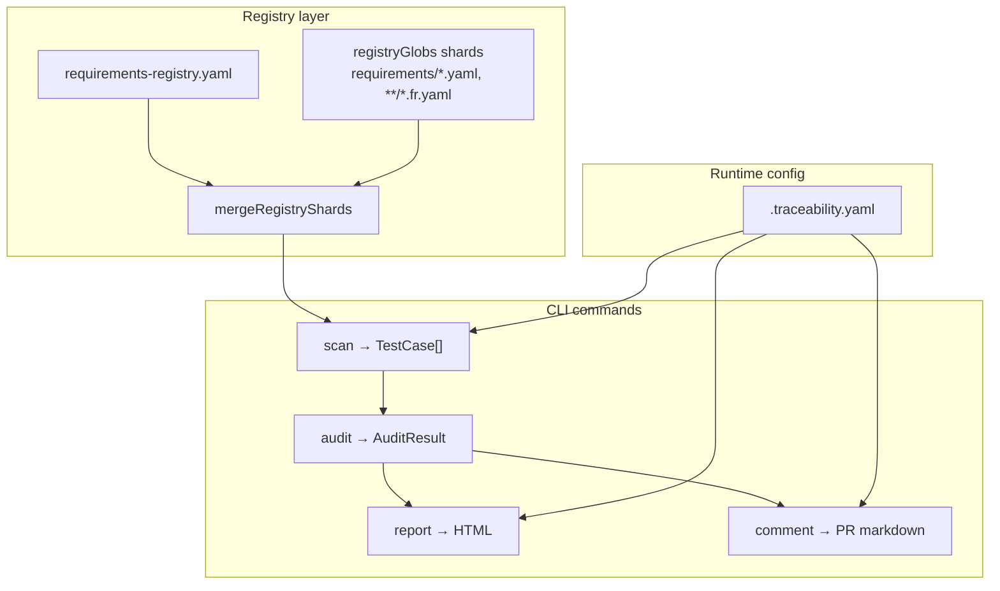
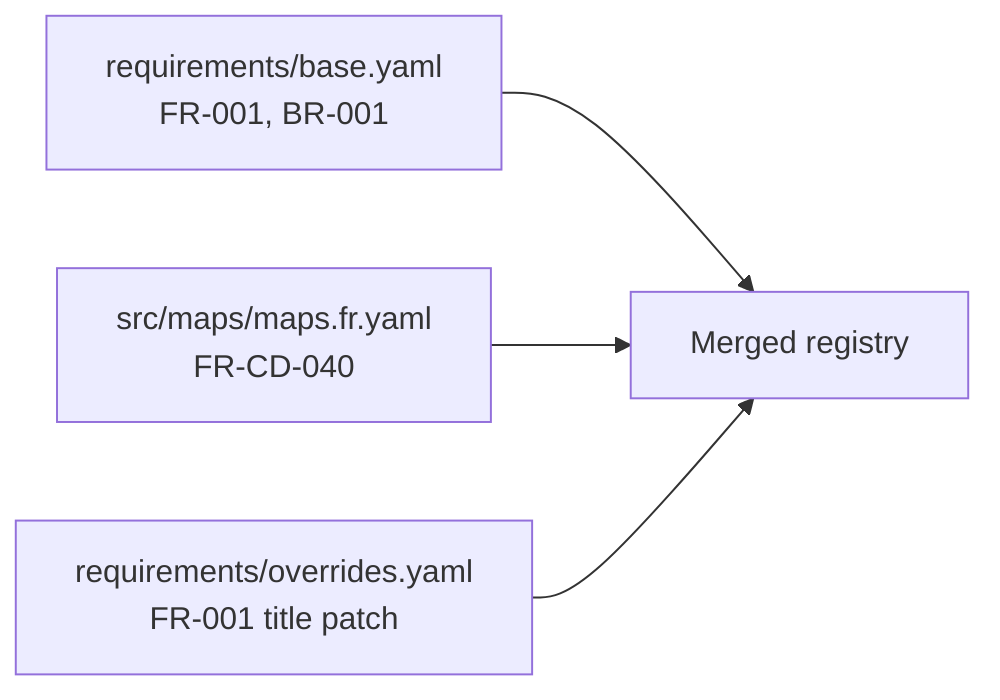
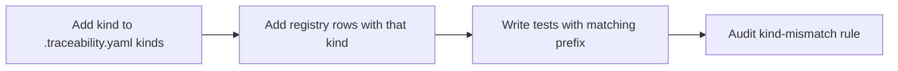
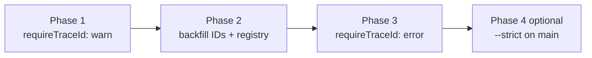

# Traceability framework — configuration

> Two configuration layers drive everything: the **requirements registry** (human-authored source of truth for IDs) and **`.traceability.yaml`** (machine config for scan, audit, report, and CI).

---

## TL;DR

- **Registry** — authoritative list of requirement IDs, kinds, titles, status, tags. One file or many shards merged via `registryGlobs`.
- **`.traceability.yaml`** — test globs, trace-ID regex, kinds, JSDoc vocabulary, link resolvers, branding, output paths, PR comment behaviour.
- The CLI loads both for `scan`, `audit`, `report`, and `comment`.

Adoption walkthrough: [onboarding.md](onboarding.md). CI wiring: [ci-integration.md](ci-integration.md).

---

## Configuration data flow



---

## `requirements-registry.yaml`

Every trace ID referenced in a test must appear here (or in a merged shard).

### Schema

```yaml
schema_version: 1

requirements:
  FR-001:
    kind: FR                 # required — must exist in .traceability.yaml kinds
    title: "Short title"     # required — single line
    summary: >               # recommended — plain-English explanation
      What this requirement asserts and why it matters.
    owner: "team-name"       # optional — default owner for coverage reports
    status: active           # optional — active | deprecated | proposed (default: active)
    priority: high           # optional — low | medium | high | critical
    related_br: [BR-001]     # optional — parent business requirements
    linked_stories:          # optional — Jira / GitHub references
      - "JIRA-1234"
      - "GH-#456"
    tags:                    # optional — searchable in HTML report as #tag-name
      - revenue
      - public-api
    deprecated_in: "2026-Q4" # optional — when retired
    replaced_by: [FR-099]    # optional — successor requirement(s)
```

### Validation rules

| Check | Failure mode |
|-------|--------------|
| `schema_version` must be `1` | Config load error |
| Registry key matches `traceIdPattern` | Load warning / audit mismatch |
| `kind` present and listed in `kinds` | Load error |
| `title` non-empty string | Load error |
| Test references `status: deprecated` row | `deprecated-requirement-referenced` warning |
| Active row with zero tests | `orphan-requirement` warning |

---

## Registry shards (`registryGlobs`)

Large products split the registry across co-located YAML files. The tracer merges them in glob order; **later files override** duplicate keys.

```yaml
# .traceability.yaml excerpt (Mappy-style)
registryGlobs:
  - "requirements/*.yaml"
  - "src/**/*.fr.yaml"
  - "src/**/*.nfr.yaml"
  - "src/**/*.sec.yaml"
  - "src/**/*.a11y.yaml"
```



**When to use shards:** teams own domains (maps, billing, auth); each folder carries its own `*.fr.yaml` beside the code. **When to use one file:** small repos, hello-desktop-style adopters.

---

## `.traceability.yaml`

### Full example

```yaml
schema_version: 1

testGlobs:
  - "**/*.test.ts"
  - "**/*.test.tsx"
  - "**/*.spec.ts"
  - "**/*.spec.tsx"
  - "cypress/**/*.cy.ts"
  - "tests/e2e/**/*.spec.ts"

exclude:
  - "**/node_modules/**"
  - "**/dist/**"
  - "**/.next/**"
  - "**/build/**"
  - "apps/mappy/**"          # monorepo: separate app registry

traceIdPattern: "\\[((?:[A-Z][A-Z0-9]*-)+\\d+)(?:,\\s*((?:[A-Z][A-Z0-9]*-)+\\d+))*\\]"
requireTraceId: error

kinds:
  BR:
    label: Business
    description: Why the product matters to the organisation or customer.
  FR:
    label: Functional
    description: User-visible behaviour.
  NFR:
    label: Non-functional
    description: Speed, reliability, cost.
  SEC:
    label: Security
    description: Data protection and abuse resistance.
  META:
    label: Meta / tooling
    description: Traceability and CI self-checks.
  A11Y:
    label: Accessibility
    description: WCAG-aligned behaviour.

registryGlobs:
  - "requirements/*.yaml"

jsdocTags:
  required: []
  optional:
    - description
    - owner
    - kind
    - priority
    - linked
    - coverage
    - external

linkResolvers:
  - prefix: "JIRA-"
    template: "https://example.atlassian.net/browse/{id}"
  - prefix: "GH-#"
    template: "https://github.com/your-org/your-repo/issues/{id}"
  - prefix: "ADR-"
    template: "docs/decisions/{id}.md"

otherReports:
  - entry: "coverage/index.html"
    label: "Vitest Coverage"
  - entry: "playwright-report/index.html"
    label: "Playwright E2E"

output:
  reportDir: traceability-report
  reportEntry: index.html
  scanJson: traceability-report/scan.json
  auditJson: traceability-report/audit.json

prComment:
  newCommentEachRun: true
  commentTitle: Traceability Audit Report

branding:
  projectName: My Application
  docsUrl: https://github.com/Underwood-Inc/requirements-tracer-action#readme
  repoUrl: https://github.com/your-org/your-repo
```

### Field reference

| Field | Type | Default | Purpose |
|-------|------|---------|---------|
| `schema_version` | integer | required | Forward-compatibility marker |
| `testGlobs` | string[] | `**/*.test.ts`, `**/*.spec.ts`, … | Files to scan |
| `exclude` | string[] | `node_modules`, `dist`, … | Skip patterns |
| `traceIdPattern` | regex string | legacy `[A-Z]+-\d+` | Extract IDs from test descriptions |
| `requireTraceId` | `error` \| `warn` \| `off` | `error` | Severity when a test has no trace ID |
| `kinds` | map | BR, FR, NFR, SEC | Requirement kinds — extensible |
| `registryGlobs` | string[] | *(none)* | Merge co-located registry YAML |
| `jsdocTags.optional` | string[] | see example | Known JSDoc tags; others → warning |
| `linkResolvers` | array | `[]` | Turn `@linked` tokens into URLs |
| `otherReports` | array | `[]` | Embed HTML reports as iframe tabs |
| `output.reportDir` | string | `traceability-report` | HTML artifact directory |
| `output.reportEntry` | string | `index.html` | Main HTML file name |
| `output.scanJson` | string | `{reportDir}/scan.json` | Machine-readable scan dump |
| `output.auditJson` | string | `{reportDir}/audit.json` | Machine-readable audit dump |
| `prComment.newCommentEachRun` | boolean | `true` | Fresh PR comment each CI run |
| `prComment.commentTitle` | string | `Traceability Audit Report` | Comment heading |
| `branding.projectName` | string | repo folder name | HTML report header |
| `branding.docsUrl` | string | Action README | Link in PR comment + report footer |
| `branding.repoUrl` | string | *(none)* | "View repo" link in report |

---

## `traceIdPattern` in depth

The recommended pattern supports domain segments and comma-separated IDs:

```yaml
traceIdPattern: "\\[((?:[A-Z][A-Z0-9]*-)+\\d+)(?:,\\s*((?:[A-Z][A-Z0-9]*-)+\\d+))*\\]"
```

| Test description | Matches |
|------------------|---------|
| `[FR-001] loads home` | `FR-001` |
| `[FR-CD-040] marker renders` | `FR-CD-040` |
| `[FR-001, SEC-001] checkout safe` | `FR-001`, `SEC-001` |

If omitted, the legacy default only matches `[FR-001]`-style IDs (single segment before the number).

---

## Extending kinds



1. Declare the kind in `.traceability.yaml`:

   ```yaml
   kinds:
     A11Y:
       label: Accessibility
       description: WCAG 2.2 aligned behaviour verified in component tests.
   ```

2. Add registry rows:

   ```yaml
   requirements:
     A11Y-001:
       kind: A11Y
       title: Form inputs have programmatic labels
   ```

3. Write tests with `[A11Y-001]` in the description.

The HTML report adds a kind section and filter pill automatically.

---

## `branding` and `otherReports`

**Branding** customizes the self-contained HTML report header/footer and the docs link in PR comments:

```yaml
branding:
  projectName: Mappy
  docsUrl: https://github.com/Underwood-Inc/requirements-tracer-action#readme
  repoUrl: https://github.com/your-org/mappy
```

**otherReports** embeds existing HTML (coverage, Playwright) as sandboxed iframe tabs — paths are relative to the repo root:

```yaml
otherReports:
  - entry: coverage/index.html
    label: Unit coverage
  - entry: playwright-report/index.html
    label: E2E report
```

Generate those reports in CI **before** `trace report` so the files exist when the tracer inlines or links them.

---

## Adoption playbook



| Phase | Setting | Effect |
|-------|---------|--------|
| 1 — discover | `requireTraceId: warn` | Surface gaps without blocking |
| 2 — backfill | local `trace audit` | Add `[…]` prefixes and registry rows |
| 3 — enforce | `requireTraceId: error` | CI blocks missing / unknown IDs |
| 4 — hygiene | `--strict` on main | Orphans and deprecated refs block too |

New greenfield repos should start at phase 3. Legacy repos ease in via phases 1–2.

---

## Related pages

- [onboarding.md](onboarding.md) — kinds catalog, report search tokens, quick start
- [jsdoc-tags.md](jsdoc-tags.md) — optional tag vocabulary
- [ci-integration.md](ci-integration.md) — `prComment`, `TRACE_ARTIFACT_URL`, annotations
