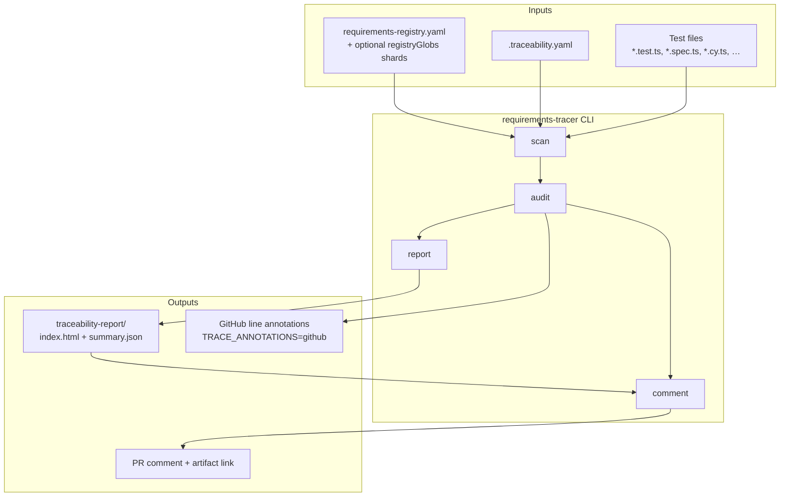
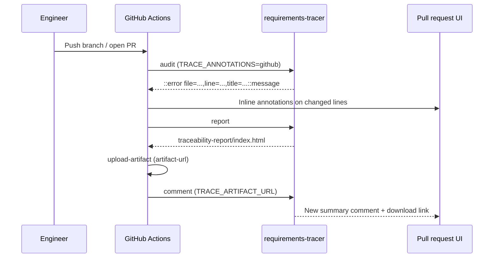
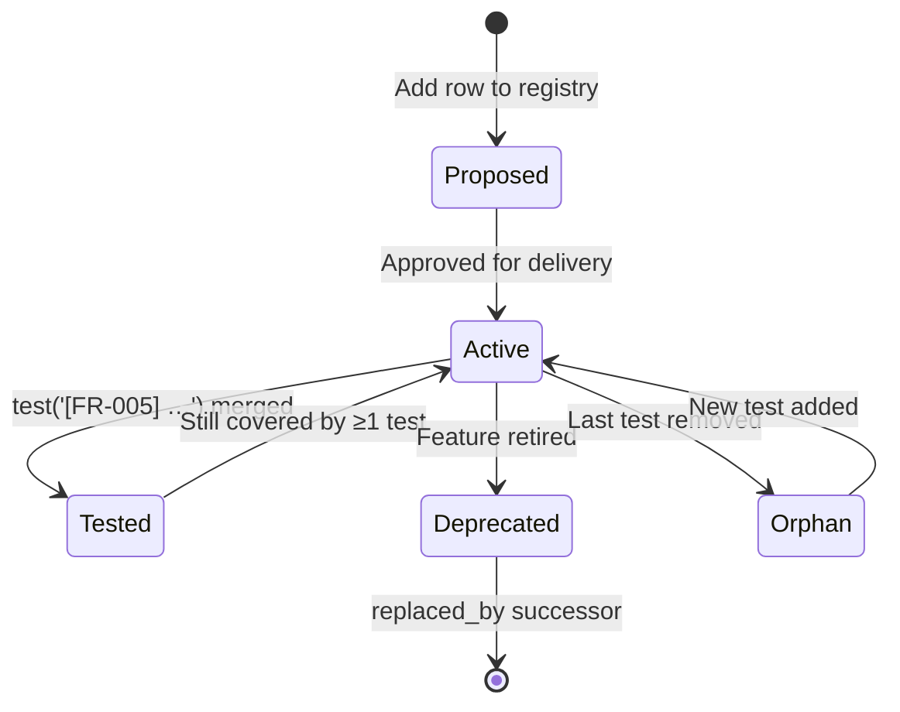

# Traceability framework — overview

> A framework that ties every automated test back to a human-readable requirement, audits trace coverage in CI, and produces a self-contained HTML report you can hand to an auditor.

---

## TL;DR (read this first)

- Every test must start with a **trace ID** like `[FR-001]` that exists in `requirements-registry.yaml` (or a merged registry shard).
- Tests can carry optional **JSDoc tags** (`@description`, `@owner`, `@kind`, `@priority`, `@linked`, `@coverage`, `@external`) for richer metadata — see [jsdoc-tags.md](jsdoc-tags.md).
- The **requirements-tracer** CLI scans test files (Vitest, Jest, Cypress, Playwright by default), audits trace IDs, and generates a **self-contained HTML artifact** with search, filters, and `summary.json`.
- **Published for any repo:** [@underwoodinc/requirements-tracer](https://www.npmjs.com/package/@underwoodinc/requirements-tracer) on npm and [Underwood-Inc/requirements-tracer-action](https://github.com/Underwood-Inc/requirements-tracer-action) on GitHub (`v0.1.3`).
- **Six audit rules** ship by default (see [Audit rules](#audit-rules)). Errors block CI; warnings are promotable with `--strict`.
- On a pull request, CI emits **inline diff annotations**, uploads the HTML report, and posts a **fresh PR comment** each run (older traceability comments are collapsed, not deleted).

**New to adoption?** Start with [onboarding.md](onboarding.md). **CI wiring?** [ci-integration.md](ci-integration.md).

---

## Who this is for

| Audience | What you get |
|----------|--------------|
| **Product / engineering leads** | Coverage broken down by requirement **kind** (FR, NFR, SEC, …), not a single percentage |
| **QA / auditors** | Searchable HTML artifact grouped by requirement; export-friendly `summary.json` |
| **Engineers** | Local `trace audit` mirrors CI; failures appear on the PR diff as GitHub annotations |
| **Platform / DevOps** | Composite Action or npm CLI; no custom scripts required |

---

## How the pieces fit



---

## Pull-request feedback (three surfaces)

When CI runs the published Action (or an equivalent workflow), engineers see failures in three places — by design, so nothing hides in a log tail.



| Surface | When to look | Details |
|---------|--------------|---------|
| **Line annotations** | Fixing a specific test file | Emitted during `audit` when `TRACE_ANNOTATIONS=github`. Appears on the **Files changed** tab. See [ci-integration.md § GitHub Actions annotations](ci-integration.md#github-actions-annotations). |
| **PR comment** | Scanning all findings at once | Posted by `comment` after audit + report. Includes error table, warnings list, artifact download. |
| **HTML artifact** | Reviewers, audit packs, PMs | Self-contained `index.html`; searchable by `@fr`, `@untested`, `#tags`, etc. |

---

## The lifecycle of one trace ID



1. **A requirement is added** to the registry (e.g. `FR-005`, `kind: FR`, `status: active`).
2. **An engineer writes a test** whose description includes `[FR-005]`. Optional JSDoc tags sit above the `test()` call.
3. **Local `trace audit`** confirms the ID is known, kinds match, and (optionally under `--strict`) no orphans remain.
4. **CI runs the same audit** on the PR. Missing or unknown IDs produce **line annotations** on the offending test.
5. **`trace report`** generates the HTML artifact grouped by requirement kind.
6. **A new PR comment** summarizes counts, lists findings, and links the uploaded artifact.

---

## Audit rules

| Rule | Default severity | Has file + line? | Blocks merge? |
|------|------------------|------------------|---------------|
| `missing-trace-id` | error | Yes | Yes |
| `unknown-trace-id` | error | Yes | Yes |
| `kind-mismatch` | error | Yes | Yes |
| `orphan-requirement` | warning | No (registry-only) | Only with `--strict` |
| `deprecated-requirement-referenced` | warning | Yes | Only with `--strict` |
| `unknown-jsdoc-tag` | warning | Yes | Only with `--strict` |
| `duplicate-jsdoc-tag` | warning | Yes | Only with `--strict` |

Rules with `filePath` and `line` become **GitHub annotations** when `TRACE_ANNOTATIONS=github`. Orphan requirements appear in the PR comment and HTML report but not on a specific line.

---

## Documentation map

| Page | What it covers |
|------|----------------|
| [onboarding.md](onboarding.md) | **Start here for adoption** — kinds, trace ID shapes, quick start, report search tokens, checklist |
| [configuration.md](configuration.md) | Full `.traceability.yaml` and registry schema, `registryGlobs`, `branding`, `otherReports` |
| [ci-integration.md](ci-integration.md) | Published Action, workflow examples, **GitHub annotations**, PR comment format, local parity |
| [jsdoc-tags.md](jsdoc-tags.md) | Optional JSDoc vocabulary and how findings surface in CI |
| [architecture.md](architecture.md) | Internal layout of `tools/requirements-tracer/` for contributors |

---

## Quick start (tool already installed)

```bash
# Audit — exits non-zero when errors exist
pnpm trace:audit

# Generate HTML artifact
pnpm trace:report

# Open locally
start traceability-report/index.html     # Windows
xdg-open traceability-report/index.html  # Linux / macOS
```

In CI, the same steps run via [Underwood-Inc/requirements-tracer-action](https://github.com/Underwood-Inc/requirements-tracer-action) or a custom workflow — see [ci-integration.md](ci-integration.md).

---

## Tone

This framework is **strict on data**, **friendly on words**. Findings say what broke and how to fix it ("Requirement SEC-007 has no tests; add `[SEC-007]` to a test description") rather than scolding.
