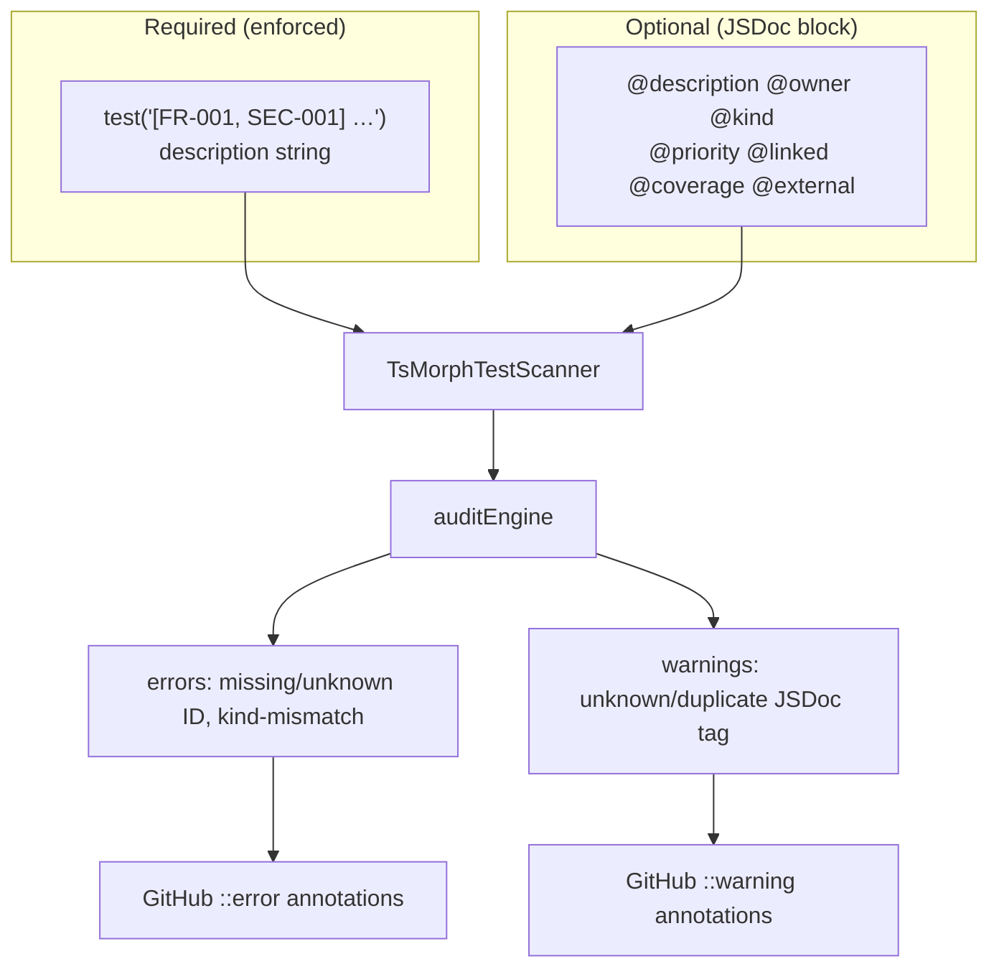

# Traceability framework — JSDoc tag vocabulary

> Optional metadata above a `test(...)` call — for auditors and PMs when the test description alone is not enough.

Configuration: [configuration.md](configuration.md) (`jsdocTags.optional`). CI behaviour: [ci-integration.md](ci-integration.md).

---

## TL;DR

- **Required:** trace ID in the **test description** — `test('[FR-001] …', () => …)`.
- **Optional:** JSDoc block **immediately above** the `test()` (no blank line).
- Test runners ignore the block; the tracer reads it during scan/audit.
- Unknown tags → `unknown-jsdoc-tag` **warning** (GitHub annotation + PR comment); `--strict` promotes to error.

---

## Where metadata lives



The trace ID **never** belongs in JSDoc — it must stay in the description so Vitest/Jest/Playwright logs and stack traces show it.

---

## Required: the trace ID

```typescript
// Single ID
test('[FR-001] payment form shows a loading state', () => { /* ... */ });

// Multiple IDs — one test covers several registry rows
test('[FR-001, SEC-001] payment form loads and redacts card data in logs', () => {
  /* ... */
});
```

Configure extraction in `.traceability.yaml`:

```yaml
traceIdPattern: "\\[((?:[A-Z][A-Z0-9]*-)+\\d+)(?:,\\s*((?:[A-Z][A-Z0-9]*-)+\\d+))*\\]"
```

If omitted, only `[FR-001]`-style IDs match — not `[FR-CD-040]`. See [onboarding.md § Trace ID conventions](onboarding.md#trace-id-conventions).

---

## Optional tags

Place a block comment **directly above** `test()` with no blank lines.

### `@description`

Longer summary for auditors who will not read the test body.

```typescript
/**
 * @description When the PSP webhook is replayed with the same idempotency key,
 *   no duplicate confirmation email is sent and no duplicate row is inserted.
 */
test('[FR-002] receipt email is idempotently dispatched', async () => { /* ... */ });
```

Surfaces in the HTML report (test row) and may appear truncated in PR summaries.

### `@owner`

Team or person responsible — useful for routing review.

```typescript
/**
 * @owner payments-platform
 */
test('[NFR-001] checkout API stays under 400ms warm', async () => { /* ... */ });
```

### `@kind`

Primary lens when one test spans multiple requirement kinds. Must agree with registry `kind` for each referenced ID or audit raises `kind-mismatch`.

```typescript
/**
 * @kind NFR
 */
test('[NFR-001] checkout API stays under 400ms warm', async () => { /* ... */ });
```

Valid values come from `.traceability.yaml` → `kinds` (defaults: BR, FR, NFR, SEC).

#### Test shapes by requirement kind

Prefer **separate tests** when proof methods differ. Use `@kind` when IDs overlap but triage has one obvious owner.

| Kind | Good fit | Avoid |
|------|----------|-------|
| `BR` | Thin journey / business outcome roll-ups | Re-asserting every FR inside one BR test |
| `FR` | User-visible behaviour, APIs, UI state | Hiding performance-only proof here |
| `NFR` | Latency, throughput, cold start, cost | Mixing SLO proof with unrelated UI checks |
| `SEC` | Authz, injection, secret redaction, abuse paths | Security expectations without a `[SEC-…]` trace ID |

### `@priority`

`low` | `medium` | `high` | `critical` — HTML report sorts within requirement groups.

```typescript
/**
 * @priority critical
 */
test('[SEC-001] card numbers never appear in logs', async () => { /* ... */ });
```

### `@linked`

Related tickets **outside** the registry — Jira, GitHub issues, ADRs.

```typescript
/**
 * @linked JIRA-1234, ADR-007
 */
test('[FR-005] discount stacking obeys precedence rules', () => { /* ... */ });
```

Resolved to URLs via `linkResolvers` in `.traceability.yaml`.

### `@coverage`

Subsystem or layer label; pairs with embedded coverage reports (`otherReports`).

```typescript
/**
 * @coverage checkout/recipe
 */
test('[FR-003] orders below minimum are rejected', () => { /* ... */ });
```

### `@external`

Vendor docs, RFCs, wiki pages.

```typescript
/**
 * @external https://stripe.com/docs/idempotency
 */
test('[FR-002] receipt email is idempotently dispatched', async () => { /* ... */ });
```

---

## Combined example

```typescript
/**
 * @description Percentage discount applies before fixed voucher on the same cart.
 * @owner growth-experiments
 * @kind FR
 * @priority high
 * @linked JIRA-1234, ADR-007
 * @coverage promotions/recipe
 * @external https://docs.example.com/promotions/v2
 */
test('[FR-005, BR-001] percentage discount applies before fixed voucher', () => {
  const cart = makeCart({ items: [{ priceCents: 5000 }] });
  const result = calculateTotal(cart, [
    { kind: 'percentage', rate: 0.1 },
    { kind: 'fixed', amountCents: 500 },
  ]);
  expect(result).toBe(4000);
});
```

---

## Anti-patterns

| Anti-pattern | Why it hurts | Fix |
|--------------|--------------|-----|
| Tag-stuffing every test | Noise in report and PR comments | Tags only where they aid audit routing |
| `@traceId FR-001` in JSDoc | Runner logs won't show the ID | Put `[FR-001]` in the description |
| Vague `test('works')` + long `@description` | Hard to grep failures | Fix the description string |

---

## Extending the tag vocabulary

Register custom tags under `jsdocTags.optional`:

```yaml
jsdocTags:
  optional:
    - description
    - owner
    - kind
    - priority
    - linked
    - coverage
    - external
    - regressionFor    # e.g. incident ticket
    - flakyExpected    # documented flake justification
```

Listed tags are parsed and shown in the HTML report. **Unlisted** tags trigger `unknown-jsdoc-tag`.

---

## How findings surface in CI

| Finding | Severity | GitHub annotation | Blocks merge |
|---------|----------|-------------------|--------------|
| Missing trace ID in description | error | `::error` on test line | Yes |
| Unknown trace ID | error | `::error` on test line | Yes |
| `kind-mismatch` | error | `::error` on test line | Yes |
| Unknown JSDoc tag | warning | `::warning` on test line | Only with `--strict` |
| Duplicate JSDoc tag | warning | `::warning` on test line | Only with `--strict` |
| Deprecated requirement referenced | warning | `::warning` on test line | Only with `--strict` |

Every finding includes a **`suggestion`** string (shown in annotation body and PR comment table).

Example annotation for an unknown tag:

```
::warning file=src/foo.test.ts,line=4,title=Unknown JSDoc tag::Tag @reviewer is not listed in jsdocTags.optional. | Add @reviewer to .traceability.yaml or remove the tag.
```

Enable annotations with `TRACE_ANNOTATIONS=github` on the audit step — see [ci-integration.md § GitHub Actions annotations](ci-integration.md#github-actions-annotations).

---

## Related pages

- [onboarding.md](onboarding.md) — kinds, trace ID shapes, report filters
- [configuration.md](configuration.md) — `jsdocTags`, `linkResolvers`
- [index.md](index.md) — audit rules overview
