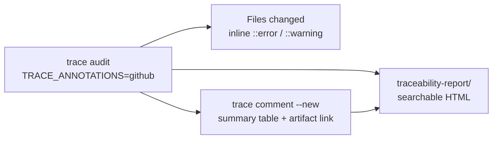

# Requirements Tracer — onboarding guide

> **In plain terms:** Link every automated test to a requirement ID in a YAML registry, audit that link in CI, and publish a searchable HTML report — for **every requirement kind** your product uses (functional, security, performance, business rules, and more), not just `FR`.

---

## TL;DR (read this first)

- **What it is:** `@underwoodinc/requirements-tracer` (npm CLI) + `Underwood-Inc/requirements-tracer-action` (GitHub Action).
- **What you configure:** `requirements-registry.yaml` (catalog of IDs) + `.traceability.yaml` (kinds, globs, trace-ID regex, output, branding, link resolvers).
- **How tests link:** Put trace IDs in the test **description** — e.g. `[FR-001]`, `[SEC-CD-003]`, or `[FR-001, SEC-001]` in one test.
- **Preset kinds:** `BR`, `FR`, `NFR`, `SEC` ship as defaults; add `META`, `A11Y`, `COMP`, or custom keys under `kinds:`.
- **Report filters:** `@fr`, `@sec`, `@untested`, `#covered`, registry `#tags`, quoted phrases — see [Report search tokens](#report-search-and-filter-tokens).
- **Latest release:** `v0.1.3` — expanded npm README, documentation refresh, cleaner CLI and report copy.
- **CI deep dive:** [ci-integration.md](ci-integration.md) — annotations, Action inputs, PR comment shape.

**Deep references:** [configuration.md](configuration.md) (every YAML field) · [jsdoc-tags.md](jsdoc-tags.md) (optional test metadata)

---

## Who this document is for

| Reader | Start here |
|--------|------------|
| **Engineer adopting the tool** | [Requirement kinds](#requirement-kinds-preset-catalog) → [Quick start](#quick-start-15-minutes) → [configuration.md](configuration.md) |
| **Lead evaluating fit** | [Stakeholders](#stakeholders-and-why-they-care) → [Use cases](#use-cases) |
| **QA / audit reviewer** | [HTML report](#the-html-report-what-reviewers-see) → [Report search tokens](#report-search-and-filter-tokens) |
| **Platform / DevOps** | [Configuration reference](#configuration-reference) → [ci-integration.md](ci-integration.md) |

---

## Glossary

| Term | Plain definition |
|------|------------------|
| **Kind** | Requirement class: `FR`, `NFR`, `SEC`, `BR`, … — drives report grouping, filters, and audit `kind-mismatch` checks. |
| **Trace ID** | Bracketed ID in a test name, e.g. `[NFR-002]` or `[FR-CD-040]`, matching a registry row. |
| **Domain segment** | Optional middle token in IDs (`FR-**CD**-040`) for product areas; supported by the recommended `traceIdPattern`. |
| **Registry shard** | Co-located YAML file merged via `registryGlobs` (Mappy-style `*.fr.yaml`, `requirements/*.yaml`). |
| **Alias (report)** | Alternate search token with the same meaning (`@covered` = `@tested`, `#review` = `#backlog`). |

---

## Requirement kinds (preset catalog)

Kinds are **not hard-coded to FR**. The tracer reads whatever you declare under `.traceability.yaml` → `kinds`. Each registry row’s `kind` must match a configured key.

### Shipped defaults (npm / Action, when `kinds` omitted)

| Kind | Label (default) | Typical tests | Example ID |
|------|-----------------|---------------|------------|
| **BR** | Business | Thin journey / policy outcomes | `BR-001` |
| **FR** | Functional | User-visible behaviour, APIs, UI | `FR-001`, `FR-CD-040` |
| **NFR** | Non-functional | Latency, throughput, reliability, cost | `NFR-001`, `NFR-PERF-002` |
| **SEC** | Security | Authz, injection, secrets, abuse limits | `SEC-001`, `SEC-AUTH-003` |

### Common extensions (add under `kinds:`)

| Kind | Label | When to use | Example ID |
|------|-------|-------------|--------------|
| **META** | Meta / tooling | Tracer self-checks, CI wiring, process | `META-001` |
| **A11Y** | Accessibility | WCAG, screen reader, motion | `A11Y-001`, `A11Y-CD-001` |
| **COMP** | Compliance | PCI, SOC2, HIPAA-style controls | `COMP-001` |
| **PRIV** | Privacy | Retention, consent, data handling | `PRIV-001` |

Example — enable META + A11Y (from Mappy):

```yaml
kinds:
  BR:   { label: Business, description: "Outcome and policy roll-ups." }
  FR:   { label: Functional, description: "Observable product behaviour." }
  NFR:  { label: Non-functional, description: "Performance and reliability." }
  SEC:  { label: Security, description: "Threat-shaped tests." }
  META: { label: Meta / tooling, description: "Traceability and CI self-checks." }
  A11Y: { label: Accessibility, description: "WCAG-aligned behaviour." }
```

**Audit rule:** If a test says `[SEC-001]` but the registry row is `kind: FR`, CI raises **`kind-mismatch`** (error). The bracket prefix must agree with the registry.

**When picking a kind for a test:** see [jsdoc-tags.md § Test shapes by requirement kind](jsdoc-tags.md#test-shapes-by-requirement-kind-when-picking-kind-or-splitting-tests).

---

## Trace ID conventions

Trace IDs live in the **`test('…')` description string**, not in JSDoc. The auditor extracts them with `traceIdPattern`.

### Supported shapes (recommended pattern)

Set this in `.traceability.yaml` (used by Mappy, hello-desktop, and the monorepo root):

```yaml
traceIdPattern: "\\[((?:[A-Z][A-Z0-9]*-)+\\d+)(?:,\\s*((?:[A-Z][A-Z0-9]*-)+\\d+))*\\]"
```

| Shape | Example test description | Notes |
|-------|--------------------------|-------|
| Single ID | `test('[FR-001] loads home view', …)` | Simplest |
| Domain segment | `test('[FR-CD-040] map marker renders', …)` | `CD` = product/domain code |
| Multi-kind in one test | `test('[FR-005, SEC-001] checkout redacts PAN in logs', …)` | One test, multiple registry rows |
| Any position | `test('returns 200 [NFR-002]', …)` | Allowed; leading prefix is **recommended** for readability |

**Legacy default** (if `traceIdPattern` omitted): `[A-Z]+-\d+` only — e.g. `[FR-001]` but **not** `[FR-CD-040]`. Override the pattern for multi-segment IDs.

### Registry row requirements

Every ID referenced in tests must exist in `requirements-registry.yaml` (or a shard merged via `registryGlobs`):

```yaml
requirements:
  FR-CD-040:
    kind: FR
    title: "Map marker renders at saved coordinates"
    status: active          # active | proposed | deprecated
    priority: high          # low | medium | high | critical
    owner: "maps"
    tags: [mappy, ui]
    linked_stories: [JIRA-1234]
    related_br: [BR-001]
```

Full field list: [configuration.md § requirements-registry.yaml](configuration.md#requirements-registryyaml).

---

## Configuration reference

Two files drive everything. **Do not skip [configuration.md](configuration.md)** for field-by-field detail.

### `.traceability.yaml` — runtime config

| Section | Purpose |
|---------|---------|
| `testGlobs` / `exclude` | Which test files to scan (Vitest, Jest, Cypress, Playwright defaults) |
| `traceIdPattern` | Regex for extracting `[…]` IDs from descriptions |
| `requireTraceId` | `error` \| `warn` \| `off` — missing ID severity |
| `kinds` | **Preset + custom requirement kinds** (see above) |
| `jsdocTags.optional` | Allowed JSDoc tags above tests; unknown tags → warning |
| `linkResolvers` | Turn `@linked` / `linked_stories` tokens into URLs |
| `registryGlobs` | Merge co-located registry shards (`requirements/*.yaml`, `**/*.fr.yaml`) |
| `otherReports` | Embed coverage / Playwright HTML as iframe tabs in the artifact |
| `output` | `reportDir`, `reportEntry`, `scanJson`, `auditJson` paths |
| `prComment` | `newCommentEachRun`, `commentTitle` |
| `branding` | `projectName`, `docsUrl`, `repoUrl` for HTML report header/footer |

Minimal multi-kind example:

```yaml
schema_version: 1

traceIdPattern: "\\[((?:[A-Z][A-Z0-9]*-)+\\d+)(?:,\\s*((?:[A-Z][A-Z0-9]*-)+\\d+))*\\]"
requireTraceId: error

kinds:
  BR:  { label: Business }
  FR:  { label: Functional }
  NFR: { label: Non-functional }
  SEC: { label: Security }
  META: { label: Meta }

jsdocTags:
  optional: [description, owner, kind, priority, linked, coverage, external]

output:
  reportDir: traceability-report
  reportEntry: index.html

prComment:
  newCommentEachRun: true
  commentTitle: Traceability Audit Report

branding:
  projectName: my-app
```

### Adoption phases for `requireTraceId`

| Phase | Setting | Effect |
|-------|---------|--------|
| 1 — discover | `warn` | Report gaps; CI still green |
| 2 — backfill | `error` locally | Fix missing IDs before push |
| 3 — enforce | `error` in CI | Block merge on missing / unknown IDs |

Optional **`--strict`** CLI flag: promotes orphan, deprecated, and unknown-JSDoc **warnings** to **errors** (use on release branches).

---

## Report search and filter tokens

The HTML report (v0.1.2+) supports the same search model as Mappy’s trace report. Combine tokens with free text, `"quoted phrases"`, `|`, and `*` wildcards.

### `@` filters (coverage, kind, priority, layer)

| Token | Alias | Meaning |
|-------|-------|---------|
| `@tested` | `@covered` | ≥ 1 linked test |
| `@untested` | `@uncovered` | No tests; not deprecated |
| `@deprecated` | — | `status: deprecated` |
| `@active` | — | `status: active` |
| `@proposed` | — | `status: proposed` |
| `@fr` | — | `kind: FR` |
| `@nfr` | — | `kind: NFR` |
| `@sec` | — | `kind: SEC` |
| `@br` | — | `kind: BR` |
| `@meta` | — | `kind: META` |
| `@critical` / `@high` / `@medium` / `@low` | — | Priority filter |
| `@e2e` | — | Has Playwright/Cypress link |
| `@unit` | — | Has Vitest/Jest link |
| `@e2e-only` | — | E2E only, no unit tests |

**Note:** Custom kinds (e.g. `A11Y`) appear in **kind filter pills** in the report UI. Use the pill or search the ID prefix (`A11Y-`) until an `@a11y` filter is added to the report engine.

### `#` disposition and registry tags

| Token | Alias | Meaning |
|-------|-------|---------|
| `#covered` | — | Has ≥ 1 test |
| `#untested` | — | Active/proposed, no tests |
| `#shipped` | — | Active, no tests (same as untested for active rows) |
| `#backlog` | `#review` | Proposed, no tests |
| `#deprecated` | — | Deprecated status |
| `#your-tag` | — | Matches row `tags:` from registry (lowercase) |

### Text search

| Syntax | Example |
|--------|---------|
| AND terms | `checkout payment` |
| OR groups | `login \| signup` |
| Exact phrase | `"blood moon"` |
| Prefix wildcard | `ruin*` |
| Combined | `@untested @sec "token expiry"` |

---

## Optional JSDoc tags (test metadata)

Tags sit in a block comment **immediately above** `test(...)`. Trace ID stays in the description.

| Tag | Purpose |
|-----|---------|
| `@description` | Longer auditor-facing summary |
| `@owner` | Team or handle |
| `@kind` | Primary lens when one test spans multiple IDs |
| `@priority` | `low` \| `medium` \| `high` \| `critical` |
| `@linked` | Jira / GitHub / ADR tokens (resolved via `linkResolvers`) |
| `@coverage` | Subsystem label (e.g. `checkout/recipe`) |
| `@external` | Vendor docs, RFCs |

Register custom tags under `jsdocTags.optional`; unknown tags → **`unknown-jsdoc-tag`** warning.

Multi-kind example:

```typescript
/**
 * @description Warm-path checkout stays under 400ms p95.
 * @owner platform
 * @kind NFR
 * @priority high
 * @linked JIRA-456
 */
test('[NFR-PERF-001] checkout API responds within budget', async () => { … });

test('[SEC-AUTH-002] expired JWT returns 401', async () => { … });

test('[FR-010, SEC-AUTH-002] login form never logs password field', async () => { … });
```

Full vocabulary: [jsdoc-tags.md](jsdoc-tags.md)

---

## The problem this solves

Teams store requirements in backlogs and specs, tests in the repo, and nothing automatically checks they still match. Requirements Tracer closes that loop **per kind** — so security and performance requirements get the same enforcement as functional ones.

---

## Stakeholders and why they care

### Engineering managers & tech leads

- HTML report breaks down coverage by **kind** (FR / NFR / SEC / …), not just a single percentage.
- CI fails on unknown IDs and kind mismatches before merge.
- `--strict` for release hygiene (orphans, deprecated references).

### Software engineers

- One convention across kinds: `[KIND-…]` in the test string.
- Local `trace audit` matches CI; failures show as **inline annotations** on the Files changed tab when `TRACE_ANNOTATIONS=github` (set automatically by the published Action).

### QA & test engineers

- Filter `@untested @sec` or `#covered` in the artifact.
- Expand test lists per requirement (unit vs e2e layer).

### Product & compliance

- Registry carries `linked_stories`, `acceptance_criteria`, tags.
- SEC / NFR rows filter separately for audit packs.

### Release & DevOps

- Direct artifact download in PR comments (`TRACE_ARTIFACT_URL` from `upload-artifact@v7`).
- **Copy release checklist (FR + e2e)** in the report UI.

---

## CI feedback on pull requests

Three surfaces — use the one that matches how you are fixing the branch:



| Surface | Best for | Doc |
|---------|----------|-----|
| **Line annotations** | Fixing a specific test file | [ci-integration.md § GitHub Actions annotations](ci-integration.md#github-actions-annotations) |
| **PR comment** | Scanning all errors/warnings on the PR | [ci-integration.md § PR comment format](ci-integration.md#pr-comment-format) |
| **HTML artifact** | PM/QA review, audit packs | [Report search tokens](#report-search-and-filter-tokens) below |

Minimal Action wiring:

```yaml
- uses: Underwood-Inc/requirements-tracer-action@v0.1.3
  with:
    tracer-package: '@underwoodinc/requirements-tracer@0.1.3'
    token: ${{ secrets.GITHUB_TOKEN }}
```

The Action sets `TRACE_ANNOTATIONS=github` on audit and passes `artifact-url` to the comment step — no extra env vars required.

---

## Use cases

1. **TDD across kinds** — register `SEC-003`, write `test('[SEC-003] …')`, implement, audit.
2. **PR gate** — annotations on the diff + artifact + fresh comment every push.
3. **Audit pack** — ship `index.html`, `summary.json`, registry export; filter by `@sec` / `@nfr`.
4. **Release verification** — `@fr @e2e` or checklist export.
5. **Registry hygiene** — orphan / deprecated warnings (`--strict` on main).
6. **Monorepo** — per-app `registryGlobs`, `working-directory`, `branding.projectName`.

---

## Published packages

| Package | URL |
|---------|-----|
| GitHub Action | [Underwood-Inc/requirements-tracer-action](https://github.com/Underwood-Inc/requirements-tracer-action) `@v0.1.3` |
| npm CLI | [@underwoodinc/requirements-tracer](https://www.npmjs.com/package/@underwoodinc/requirements-tracer) |
| Reference adopter | [hello-desktop](https://github.com/Underwood-Inc/hello-desktop) |

---

## Quick start (15 minutes)

### 1. Install

```bash
npm install -D @underwoodinc/requirements-tracer@0.1.3
```

### 2. Registry (multi-kind)

```yaml
schema_version: 1
requirements:
  FR-001:
    kind: FR
    title: Application loads home view
    status: active
    priority: high
  NFR-001:
    kind: NFR
    title: Home view loads within 2s on cold start
    status: active
    priority: medium
  SEC-001:
    kind: SEC
    title: Session cookie is HttpOnly
    status: active
    priority: critical
```

### 3. `.traceability.yaml`

Use the [minimal multi-kind example](#traceabilityyaml--runtime-config) above; set `traceIdPattern` if you use domain segments (`FR-CD-001`).

### 4. Tests

```typescript
test('[FR-001] loads home view', () => { … });
test('[NFR-001] home view loads within budget', async () => { … });
test('[SEC-001] session cookie is HttpOnly', () => { … });
```

### 5. Local audit

```bash
npx trace audit --root .
npx trace report --root .
```

### 6. GitHub Actions

```yaml
- uses: Underwood-Inc/requirements-tracer-action@v0.1.3
  with:
    tracer-package: '@underwoodinc/requirements-tracer@0.1.3'
    token: ${{ secrets.GITHUB_TOKEN }}
```

---

## The HTML report (what reviewers see)

| Section | Purpose |
|---------|---------|
| Overview | Counts by kind, e2e coverage, audit errors/warnings |
| Coverage by kind | FR / NFR / SEC / … table |
| Audit findings | Rule, file, line, suggestion |
| Requirements table | Search tokens above, sort, expandable tests |
| Unknown IDs | Typos and hallucinated IDs |

Also: `summary.json` for automation.

---

## Audit rules at a glance

| Rule | Severity | Meaning |
|------|----------|---------|
| `missing-trace-id` | error | No `[…]` ID in test description |
| `unknown-trace-id` | error | ID not in registry |
| `kind-mismatch` | error | Bracket prefix or `@kind` ≠ registry `kind` |
| `orphan-requirement` | warning | Registry row with zero tests |
| `deprecated-requirement-referenced` | warning | Test still uses deprecated ID |
| `unknown-jsdoc-tag` | warning | Tag not in `jsdocTags.optional` |

---

## Multi-project adoption

| Pattern | When |
|---------|------|
| **A — published npm** | External repos; `tracer-package` input |
| **B — vendored source** | Monorepo with `tools/requirements-tracer/` |
| **C — per-app registries** | Mappy-style shards + `registryGlobs` |

---

## Adoption checklist

- [ ] `kinds` lists every prefix you use (FR, NFR, SEC, META, A11Y, …)
- [ ] `traceIdPattern` matches your ID shape (simple vs domain-segmented)
- [ ] Registry rows exist for every `[…]` ID in tests
- [ ] `jsdocTags.optional` includes tags your team uses
- [ ] `trace audit` clean locally; Action on PRs
- [ ] Team knows report search tokens (`@untested`, `@sec`, `#tags`)

---

## Anti-patterns

| Anti-pattern | Fix |
|--------------|-----|
| Only registering FR rows | Add NFR / SEC / BR rows; kinds are first-class |
| Using FR tests for SEC proof | Separate `[SEC-…]` IDs and kind |
| `@traceId` in JSDoc instead of description | ID must be in `test('…')` string |
| Omitting `traceIdPattern` but using `FR-CD-001` IDs | Set multi-segment pattern (see above) |
| Parallel spreadsheets | Registry + audit are canonical |

---

## References

| Resource | Link |
|----------|------|
| **Configuration (full YAML reference)** | [configuration.md](configuration.md) |
| **JSDoc tag vocabulary** | [jsdoc-tags.md](jsdoc-tags.md) |
| **CI integration** | [ci-integration.md](ci-integration.md) |
| **Framework overview** | [index.md](index.md) |
| Action repository | https://github.com/Underwood-Inc/requirements-tracer-action |
| npm package | https://www.npmjs.com/package/@underwoodinc/requirements-tracer |
| hello-desktop example | https://github.com/Underwood-Inc/hello-desktop |
